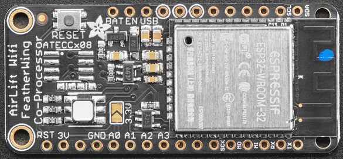

# AirLift FeatherWing ESP32 WiFi Co-Processor

https://learn.adafruit.com/adafruit-airlift-featherwing-esp32-wifi-co-processor-featherwing/pinouts

## Power Pins

- GND - Common power/logic ground.
- BAT - Positive voltage from JST on Feather for an optional LiPo battery.
- USB - Positive voltage to/from the Micro USB jack if connected.
- EN - 3.3V regulator's enable pin. It's pulled up, so connect to ground to disable the 3.3V regulator
- 3V - this is the output from the 3.3V regulator. The regulator can supply 500mA peak but half of that is drawn by the ESP32, and it's a fairly power-hungry chip. So if you need a ton of power for stuff like LEDs, motors, etc. Use the USB or BAT pins, and an additional regulator

## SPI and Control Pins

To keep transfers speedy, we use SPI not UART Serial. UART is too slow and hard to synchronize. This uses more pins but the experience is much better!

### Classic SPI Pins

- SCK - SPI Clock from your microcontroller, level shifted so can be 3-5V logic
- MISO - SPI Data from the AirLift to the microcontroller, this is 3.3V logic out, can be read by 3-5V logic. This is tri-stated when not selected, so you can share the SPI bus with other devices.
- MOSI- SPI Data to the AirLift from the microcontroller, level shifted so can be 3-5V logic
- ESPCS - SPI Chip Select from the microcontroller to start sending commands to the AirLift, level shifted so can be 3-5V logic

### Required Control Pins

- ESPBUSY - this pin is an input from the AirLift, it will let us know when its ready for more commands to be sent. This is 3.3V logic out, can be read by 3-5V logic. This pin must be connected.
- ESPRST- this pin is an output to the AirLift. Set low to put the AirLift into reset. You should use this pin, even though you might be able to run for a short while without it, it's essential to 'kick' the chip if it ever gets into a locked up state. Level shifted so can be 3-5V logic

### Optional Control Pins

- ESPGPIO0 - this is the ESP32 GPIO0 pin, which is used to put it into bootloading mode. It is also used if you like when the ESP32 is acting as a server, to let you know data is ready for reading. It's not required for WiFi, but you'll need to connect it to use BLE mode. Solder the pad on the bottom of the FeatherWing to connect it.
- ESPRX & ESPTX - Serial data in and Serial data out, used for bootloading new firmware, and for communication when in BLE mode. Leave disconnected if not using BLE or when not uploading new WiFi firmware to the AirLift (which is a rare occurrence). You'll need to solder the two pads on the bottom of the FeatherWing to use these pins.

## RGB LED

There is a small RGB LED to the left of the ESP32. These RGB LEDs are available in the Arduino and CircuitPython libraries if you'd like to PWM them for a visual alert. They're connected to the ESP32's pins 26 (Red), 25 (Green), and 27 (Blue).

## I2C

The AirLift FeatherWing does not use the I2C pins (SCL, SDA) of the Feather its connected to - these pins are free to be used by external I2C sensors.
