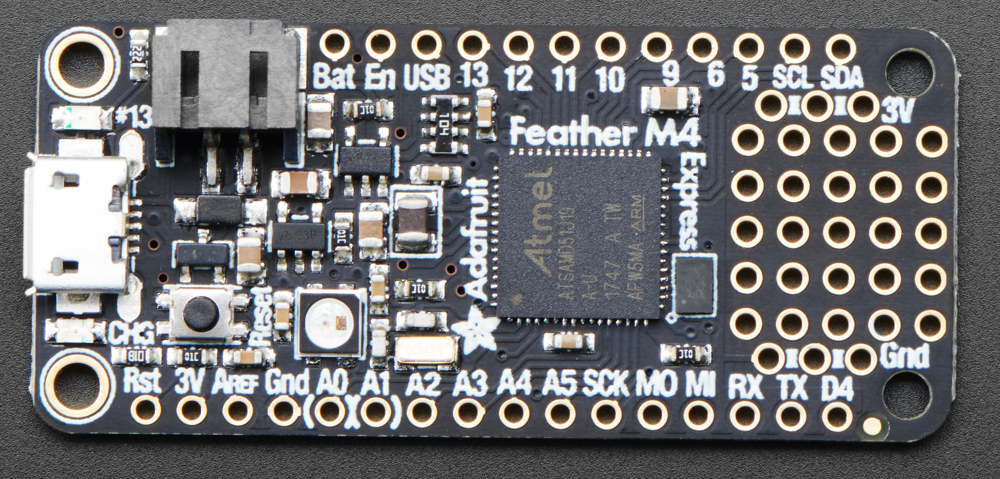
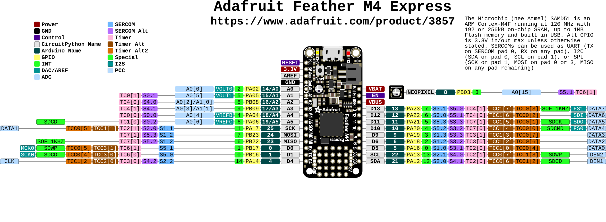

# Adafruit Feather M4 Express

https://learn.adafruit.com/adafruit-feather-m4-express-atsamd51/pinouts

## Power Pins

- GND - this is the common ground for all power and logic
- BAT - this is the positive voltage to/from the JST jack for the optional Lipoly battery
- USB - this is the positive voltage to/from the micro USB jack if connected
- EN - this is the 3.3V regulator's enable pin. It's pulled up, so connect to ground to disable the 3.3V regulator
- 3V - this is the output from the 3.3V regulator, it can supply 500mA peak

## Logic pins

This is the general purpose I/O pin set for the microcontroller.
All logic is 3.3V

Nearly all pins can do PWM output

All pins can be interrupt inputs

- #0 / RX - GPIO #0, also receive (input) pin for Serial1 (hardware UART). Also PWM out
- #1 / TX - GPIO #1, also transmit (output) pin for Serial1. PWM out
- SDA - the I2C (Wire) data pin. There's no pull up on this pin by default so when using with I2C, you may need a 2.2K-10K pullup. Also GPIO #21. Also PWM out
- SCL - the I2C (Wire) clock pin. There's no pull up on this pin by default so when using with I2C, you may need a 2.2K-10K pullup. Also GPIO #22. Also PWM out
- #4 - GPIO #4, PWM out
- #5 - GPIO #5, PWM out
- #6 - GPIO #6, PWM out
- #9 - GPIO #9, PWM out
- #10 - GPIO #10, PWM out
- #11 - GPIO #11, PWM out
- #12 - GPIO #12, PWM out
- #13 - GPIO #13, PWM out and is connected to the red LED next to the USB jack
- SCK/MOSI/MISO - These are the hardware SPI pins, you can use them as everyday GPIO #25/#24/#23 pins (but recommend keeping them free as they are best used for hardware SPI connections for high speed.)

### Analog Pins

- A0 - This pin is analog input A0 but is also an analog output due to having a DAC (digital-to-analog converter). You can set the raw voltage to anything from 0 to 3.3V, unlike PWM outputs this is a true analog output
- A1 - This pin is analog input  A1 but is also an analog output due to having a DAC (digital-to-analog converter). This is the second DAC, and is 'independent' of A0. You can set the raw voltage to anything from 0 to 3.3V, unlike PWM outputs this is a true analog output. Also can do PWM.
- A2 thru A5 - These are each analog input as well as digital I/O pins. These pins can also do PWM.

### I2S Pins

- #1/Tx - I2S bit_clock pin.
- #10 - I2S word_select pin.
- #11 - I2S data pin.

These pins are available in CircuitPython under the board module. Names that start with # are prefixed with D and other names are as is. So #0 / RX above is available as board.D0 and board.RX for example.

### Parallel Capture Peripheral

There's a 'camera' input peripheral you can use with some camera chips to capture video with 8-bit data width. We thought this was neat so we made sure all those pins were available. Here are the PCC pins (left) and the Feather M4 pins it's mapped to. Unlike other peripherals, you cannot mux these signals to other pins!

- DEN1: SDA
- DEN2: SCL
- CLK: D6
- D0: D11
- D1: D13
- D2: D10
- D3: D12
- D4: MISO
- D5: D5
- D6: MOSI
- D7: SCK

## QSPI Flash and NeoPixel

As part of the 'Express' series of boards, the Feather M4 Express is designed for use with CircuitPython. To make that easy, we have added two extra parts to this Feather M4: a mini NeoPixel (RGB LED) and a 2 MB QSPI (Quad SPI) Flash chip
arduino_compatibles_qspi.jpg

The NeoPixel is connected to pin #8 in Arduino, so [just use our NeoPixel library](https://learn.adafruit.com/adafruit-neopixel-uberguide) and set it up as a single-LED strand on pin 8. In CircuitPython, the NeoPixel is `board.NEOPIXEL` and the library for it is [here](https://github.com/adafruit/Adafruit_CircuitPython_NeoPixel/releases) and in [the bundle](https://github.com/adafruit/Adafruit_CircuitPython_Bundle/releases). The NeoPixel is powered by the 3.3V power supply but that hasn't shown to make a big difference in brightness or color. The NeoPixel is also used by the bootloader to let you know if the device has enumerated correctly (green) or USB failure (red). In CircuitPython, the LED is used to indicate the runtime status.

The QSPI Flash is connected to 6 pins that are not brought out on the GPIO pads. This way you don't have to worry about the SPI flash colliding with other devices on the main SPI connection.

QSPI is neat because it allows you to have 4 data in/out lines instead of just SPI's single line in and single line out. This means that QSPI is at least 4 times faster. But in reality is at least 10x faster because you can clock the QSPI peripheral much faster than a plain SPI peripheral

However, the QSPI port is not also on an SERCOM. So, you have to either use the QSPI peripheral or bitbang SPI if you want to talk to the chip. [We have an Arduino library here which provides QSPI interfacing for Arduino](https://github.com/adafruit/Adafruit_QSPI). In CircuitPython, the QSPI flash is used natively by the interpretter and is read-only to user code, instead the Flash just shows up as the writeable disk drive!

## Other Pins!

- RST - this is the Reset pin, tie to ground to manually reset the ATSAMD51, as well as launch the bootloader manually
- ARef - the analog reference pin. Normally the reference voltage is the same as the chip logic voltage (3.3V) but if you need an alternative analog reference, connect it to this pin and select the external AREF in your firmware. Can't go higher than 3.3V!

On the Feather M4, at least for now, AREF is tied to 3.3V due to a silicon v0 bug that does not allow the DACs to work unless AREF is connected to 3.3V. You cut the bottom jumper if you need a different AREF voltage but note that this may change DAC range!

## Debugging Interface

If you'd like to do more advanced development, trace-debugging, or not use the bootloader, we have the SWD interface exposed. You'll have to solder to the two SWD/SWCLK pads on the bottom.
