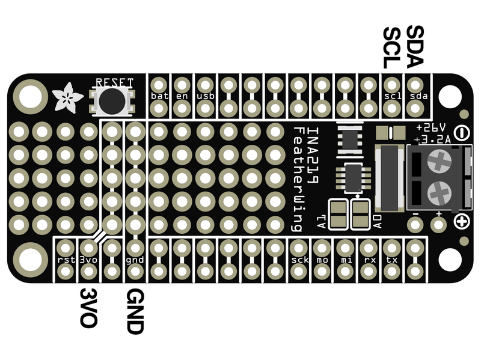

# INA219 FeatherWing Current Sensor

## Power Pins

The sensor on the breakout requires between a 2.7V and 5.5V, and can be easily used with most microcontrollers from an Arduino to a Feather or something else.

- `VIN` - This is the power pin. To power the board, give it the same power as the logic level of your microcontroller - e.g. for a 5V micro like Arduino, use 5V, or for a Feather use 3.3V.
- `GND` - This is common ground for power and logic.

## I2C Pins

Default address is `0x40`.

- `SCL` - This is the I2C clock pin, connect to your microcontroller's I2C clock line. There's a 10K pullup on this pin.
- `SDA` - This is the I2C data pin, connect to your microcontroller's I2C data line. There's a 10K pullup on this pin.
- `STEMMA QT` - These connectors allow you to connect to development boards with STEMMA QT connectors, or to other things, with various associated accessories.

## Other Pins

- `Vin+` is the positive input pin. Connect to supply for high side current sensing or to load ground for low side sensing.
- `Vin-` is the negative input pin. Connect to load for high side current sensing or to board ground for low side sensing
- `A0` and `A1` solder jumpers - These can be bridged with solder to pull the address pin up to VIN to change the I2C address according to the list below.

## I2C Addresses Based on Jumpers

- Default = `0x40`
- `A0` soldered = `0x41`
- `A1` soldered = `0x44`
- `A0` and `A1` soldered = `0x45`
