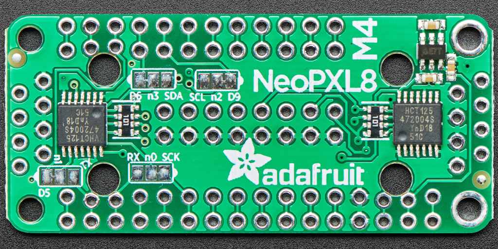

# NeoPXL8 FeatherWing M4

https://learn.adafruit.com/adafruit-neopxl8-featherwing-and-library/neopxl8-featherwing

https://adafruit.github.io/Adafruit_NeoPXL8/html/index.html

Outputs 4 through 7 are not negotiable — they must go to pins 13 through 10 (though they can be reordered within that series). For the other four outputs, there’s a limited ability to reassign things.

On the component side of the FeatherWing you’ll see several solder pad groups, labeled “n0”, “n1”, “n2” and “n3”.

Each of these four pins has a default assignment. To change a pin to an alternate setting, use a hobby knife or file to cut the trace between the center and default pads, then apply a solder bridge between the center and alternate pad.

Output Number|Default Pin|Alternate Pin
--|--|--
n0|SCK|RX
n1|D5|TX
n2|D9|SCL
n3|D6|SDA
